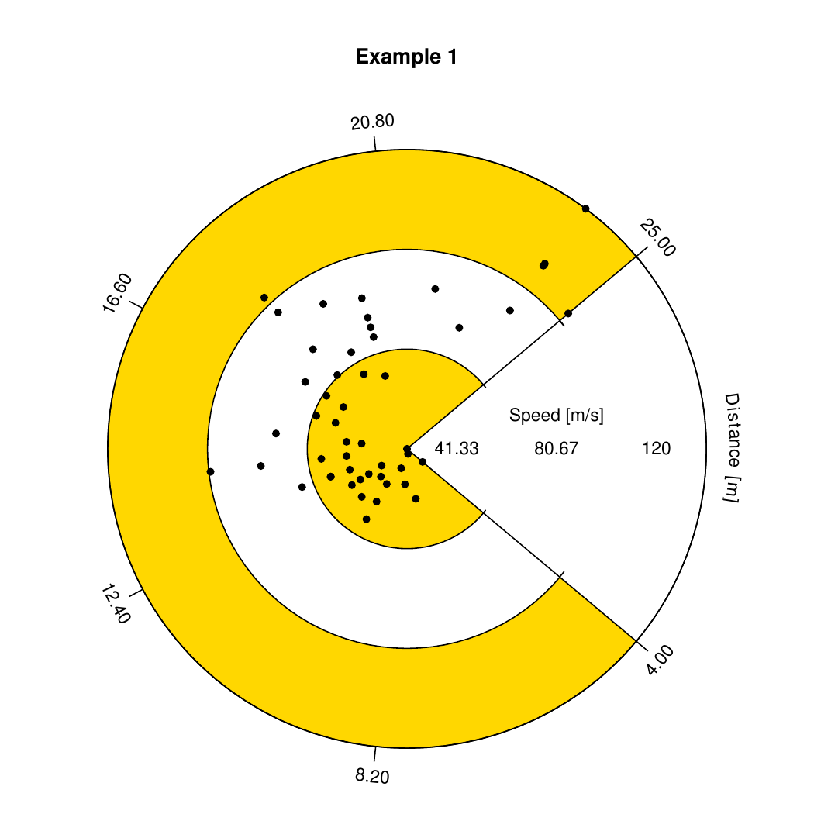

# Pac-Man Plot

## Description

## Usage
The function is setup to implement an arbitrary regression model and supports residual standardization.
As we have discussed above,

```R
pac.plot(
  x,y,
  title,
  xaxislabel,
  yaxislabel,
  xunits,
  yunit,
  color1 = "gold",
)
```
## Examples
For the following examples, the domain and range that will be processed by the
function will be:

```R
data("cars")
x <- cars$dist
y <- cars$speed

pac.plot(cars$speed,cars$dist, 'Example 1', c("Distance", "m"), c("Speed", "m/s"))
```

```{r, figure4, out.width="100%", fig.cap='Graphical result of Example 1. A basic example of how the relationship between the speed and distance of the car can be visualized.', dev='svglite', fig.align='center', echo=FALSE}

```
\newpage
