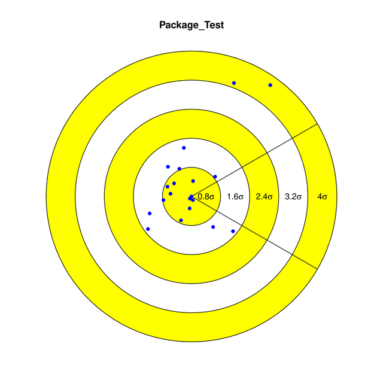
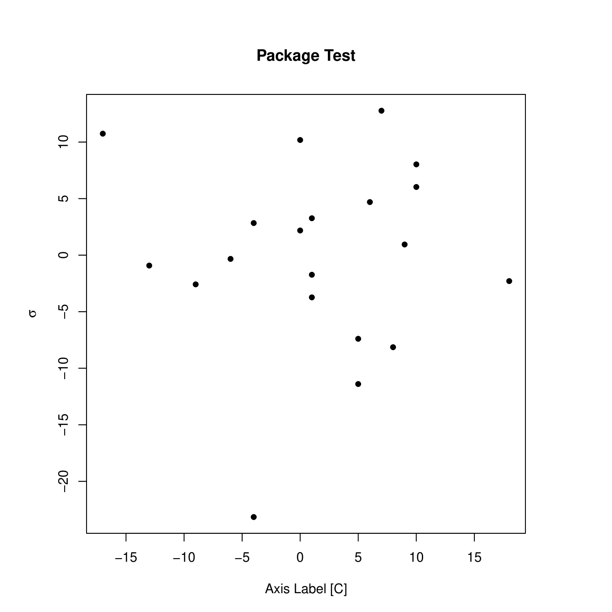

# Summary
The results of a regression algorithm typically takes the form of a residual plot, showing the relationship (or lack thereof) between the domain and the standard deviation of the data associated with the model. From the residual, the performance of the model can be determined.

`pacres` contributes a novel approach for looking at the broad view performance of the regression model by constructing a 'Pac-Man' residual plot. This visualization technique applies a bijective map from the domain of the data to angular values between 40 and 320 degrees,
\begin{equation}
X: \rightarrow [40, 320]\, .
\end{equation}
This restriction is applied to allow space for radial labels.By taking the absolute value of the factors of standard deviation on the radial coordinate system, we can observe the overall performance of the model with relative ease.

There are shortcomings for a visualization that views big-picture components of a model. In the case of the 'Pac-Man' residual plot we lose the ability to determine the dependence of the relationship. Through a traditional residual plot, it would be simple to determine if there was systematic or random error based on the relationship between the standard deviation and the domain of the data.   

# Usage
```
library(pacres)

# Pac-Man Residual
x <- c(-17, 9, -13, 0, 8, 1, 1,)
y <- c(11, -1, -1, 9, -10, -3, -5)

pacres(x,y, "Package Test", "\u00B0C", "Axis Label")

# Traditional Residual (for comparison)
par(oma=c(0,0,1,0), mar=c(5,5,5,5), cex=0.9)
plot(x, resid(lm(y~x, data=data.frame(x,y))),
  col=c("Black"), pch=16,
  xlab="Axis Label [C]",
  ylab=expression(sigma),
  main="Package Test")

```
Pac-Man Reisudal | Traditional Residual
:---------------:|:------------------:
 | 

# Acknowledgments

# References
